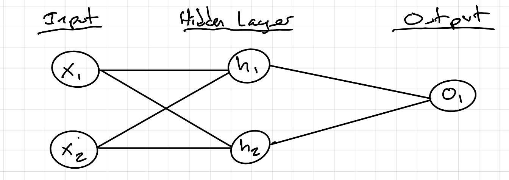

# Detailed Explanation/Tuturial of Project
In order to ensure understanding of the concepts behind neural networks, I will format this tutorial in the most simple way possible. Do not feel discouraged if there are some thing that you don't understand right away. Learning is part of the process.  

## Notation
Throughout this explanation I will be using the following notations that you should understand before diving into the rest:  
1. x(n), where x is the input and n is the input number (For example if there are two different inputs, they would be x(1) and x(2)).
2. w(n), where w is the weight and n is the weight number.
3. b(n), where b is the bias and n is the bias number.
4. y, where y is the output.
5. h(n), where h is the hidden layer neuron and n is the hidden layer neuron number.
6. o(1), where o is the output neuron.
7. n, where n is the number of samples.
8. y_true, where y_true is the known label.
9. y_pred, where y_pred is what the network outputs or "predicts".

## Building Blocks: Neurons
The building blocks of even the most complex neural networks are the individual neurons.   
Neurons take in a certain amount of inputs, and return an (usually one) output. In this explanation, I will use the example of a neuron that takes in two seperate inputs, and returns one single output.   

### Weights and Biases
Neurons use things called weights and bias in order to manipulate the inputs to output an adjusted value. Here is the process behind a neuron:  
1. Each input is multipled by its respective weight. If the neuron takes in two inputs, like in this example, there will be two weights used.  
       Math: x(n) -> x(n) * w(n)  
2. All the weighted inputs are added together with a bias. There is one bias per neuron. NOT per input.  
       Example: (x(1) * w(1)) + (x(2) * w(2)) + b
     
This is basically all the neuron does.  

### Activation Function
After the inputs are passed through the core of the neuron and affected by the weights and the biases, that singular value is then passed through an activation function. 
Activation functions, like the sigmoid function, are used to do two things:  
1. Squash arbitrary values outputted by the neuron into a range of 0-1.  
2. Introduce non-linearity to the network, helping it recognize more complex patterns in data.  
In the sigmoid function, large positive values become closer to 1 and large negative numbers become closer to 0. In this way, the outputs are more predictable and their scale is not dependant on the inputs to the neuron.  

Sigmoid function is given by:  


### Full Neuron Example:
This example neuron will take in two inputs and have the following parameters:
w = [0, 1] and b = 4    (The array format of the weights may seem a bit confusing. Basically, it is saying that if we give the inputs in the same form: [x(1), x(2)], the weights will correspond to the inputs they match up with)

Inputs: [2, 3], where 2 is x(1) and 3 is x(2).  
Multiply weights with corresponding input and add bias:  
(w(1) * x(1) + w(2) * x(2)) + b  
=> ((0 * 2) + (1 * 3)) + 4  
=> 3 + 4  
=> 7  
This is the 'raw' output. Now we must pass it through the activation function (sigmoid):  
1 / (1 + e^-x)  
=> 1 / (1 + e^-7)  
=> 0.999  

This is our final output!  

This process of passing inputs into a neuron and getting an output back is called `feed forward`. This will be ideal for testing neural networks as it gives their prediction.  
  
When coding this single neuron:  

1. Define the activation function we will use (sigmoid) using NumPy.
2. Initialize a class called Neuron so we can easily set its own attributes (weights, bias).
3. Set `self.weights` and `self.bias` to random values.
4. Define the `__call__` method that is the core function of the neuron. This will be called every time there is an instance of the Neuron class:
```python
def __call__(self, x):  
    total = np.dot(self.weights, x) + self.bias  
    return sigmoid(total) 
```
This will make it so that whenever Neuron is called, it will automatically take the inputs and weights and bias and do the usual function.

## Neural Networks: Multiple Neurons
A simple neural network is just a bunch of those neurons connected together. Zooming out from the individual neuron, we can visualize the network like this:  



1. h(1), h(2), and o(1) are all neurons with their own independent weights and biases.  
2. The inputs for o(1) are the outputs of h(1) and h(2).

The h neurons are all apart of the hidden layer in the network. The o neuron is the output neuron that puts it all together to give us one final value.  

### Feed Forward Method
This method involves:  
1. Passing in inputs as x(1) and x(2) and through the neurons in the **hidden layer**.
2. Taking the outputs of h(1) and h(2) and inputing those values into output neuron.
3. Results in a **single** value being outputed.

### Example: 
Weights = [0, 1] and bias = 0  

Hidden Layer:  
h(1) = h(2) = (w(1) * x(1) + w(2) * x(2)) + b  
=> ((0 * 2) + (1 * 3)) + 0  
=> 3  
Put through sigmoid activation function:  
h(1) = h(2) = 0.953  
***It is important to note that the only reason why h(1) = h(2) is because the weights and bias of both of those neurons are the same. If they were not set equally (which they usually aren't), they would not be equal.***  

Output Neuron:   
o(1) = (w(1) * h(1)) + (w(2) * h(2)) + b  
=> (0 * 0.953) + (1 * 0.953) + 0  
=> 0.953  
Put through sigmoid activation function:  
o(1) = 0.7216  

You have just learned a simple neural network! Not so bad right? Now let's dive into how to code it in Python using just NumPy.

### Coding the Network
When coding a network of neurons, it's best to use Python's Object-Oriented Programming capabilities. 


